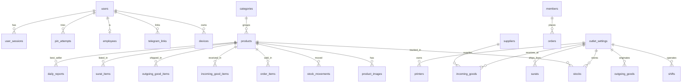
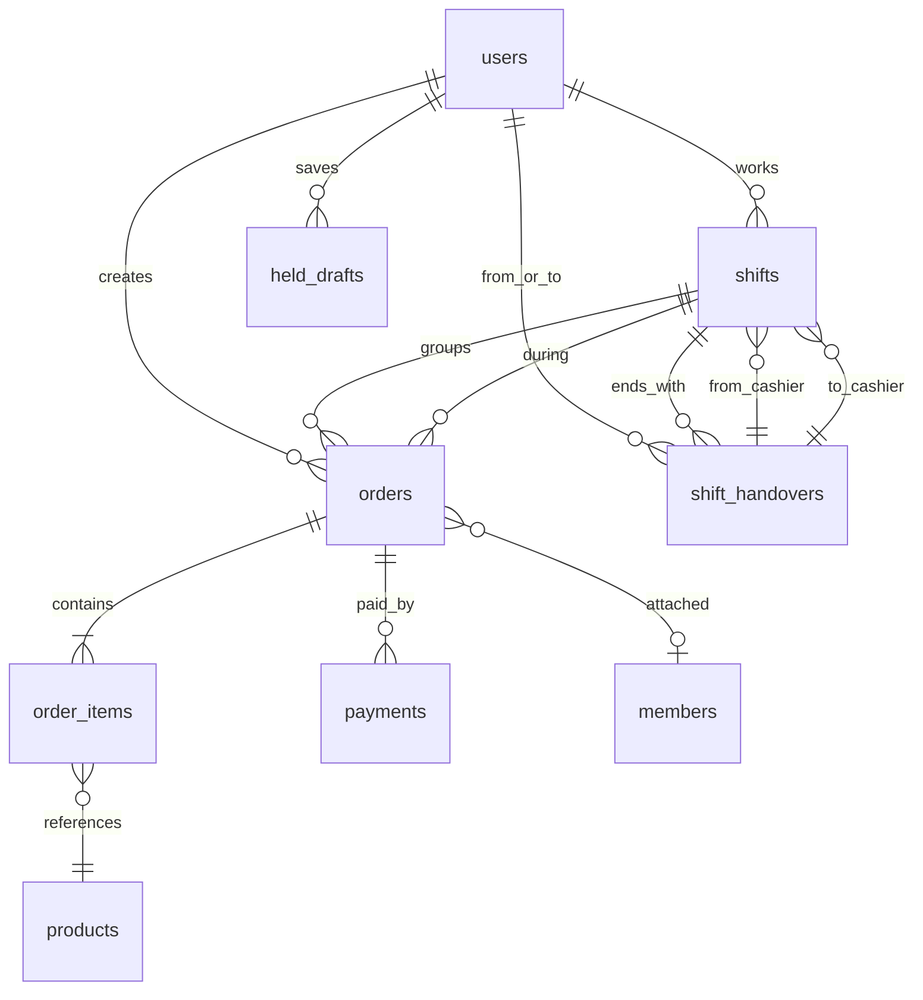
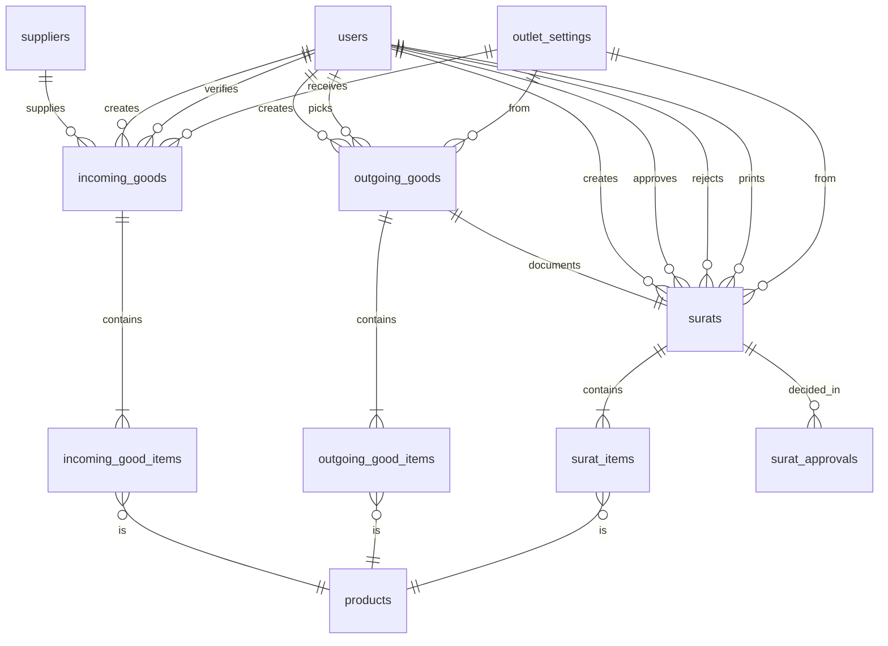
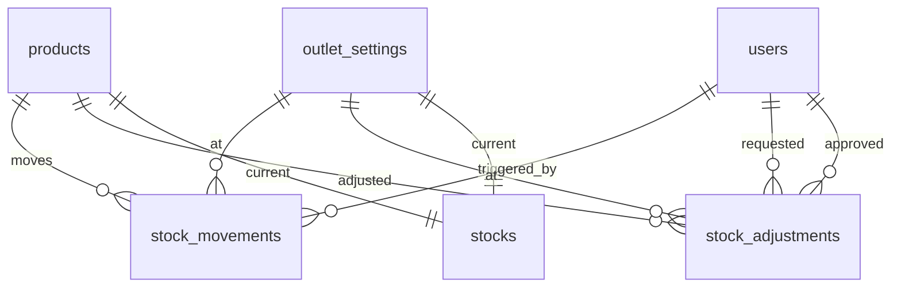
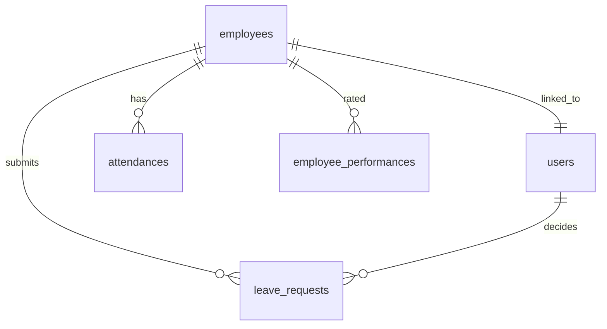
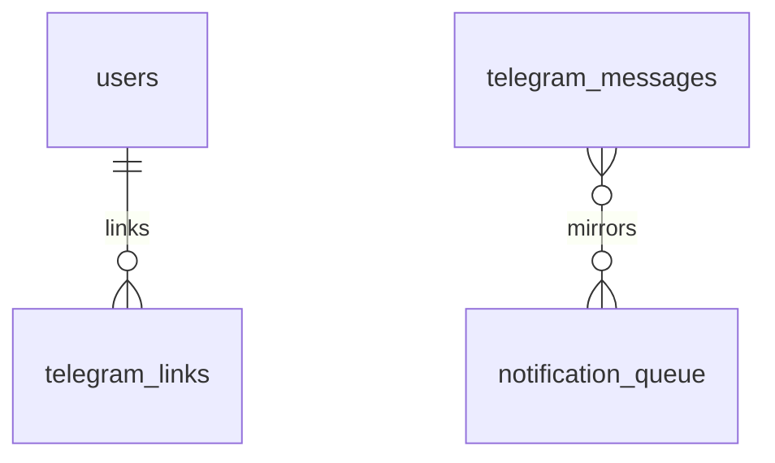
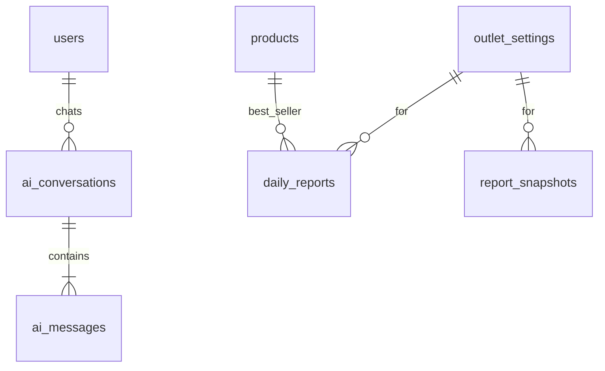
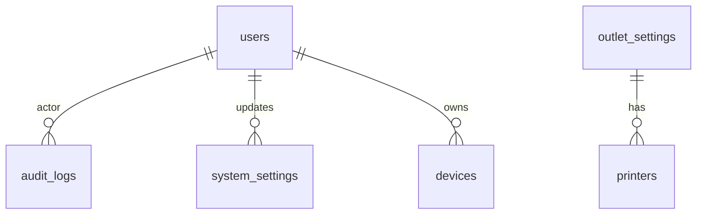
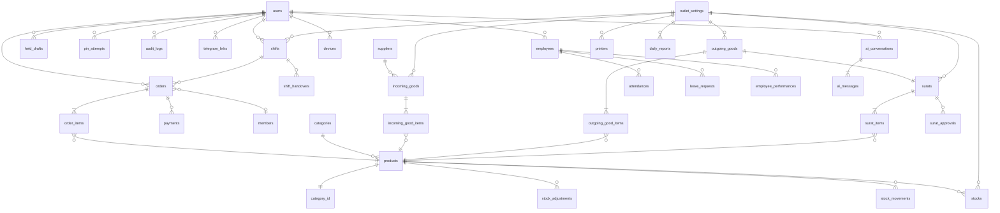

# ERD — HEKAS POS

**Versi**: 1.0.0
**Tanggal**: 2026-06-19
**Status**: Visualisasi relasi database
**Dasar**: `DATABASE_DESIGN.md` v1.0.0
**Format**: Mermaid `erDiagram`

---

## 1. Cara Baca

- Diagram menggunakan notasi Mermaid `erDiagram`.
- Relasi ditulis `EntityA ||--o{ EntityB : "label"` (Crow's foot).
- Kardinalitas:
  - `||` = exactly one
  - `o|` = zero or one
  - `}o` = zero or many
  - `}|` = one or many
- Karena Mermaid `erDiagram` punya keterbacaan rendah untuk >15 entitas, diagram dipecah per domain. Lihat section 3 untuk **Diagram Gabungan** (ringkasan lintas domain).

## 2. Diagram per Domain

### 2.1 Auth & Master



### 2.2 POS & Shift



### 2.3 Inventory Operations (PO, Outgoing, SJ)



### 2.4 Stock Ledger



### 2.5 HR & Karyawan



### 2.6 Telegram & Notification



### 2.7 AI & Reports



### 2.8 Audit & System



## 3. Diagram Gabungan (Ringkasan Lintas Domain)

Diagram ini menampilkan entity utama lintas domain. **Catatan**: Tabel sangat besar, render mungkin lambat di GitHub. Gunakan section 2 untuk detail per domain.



## 4. Relasi Kunci (Prose)

### 4.1 POS Lifecycle
```
users (kasir) ──creates──> shifts
shifts ──groups──> orders
orders ──contains──> order_items ──references──> products
orders ──paid_by──> payments
orders ──attached_to──> members (optional)
```

### 4.2 Inventory Lifecycle
```
suppliers ──supplies──> incoming_goods ──contains──> incoming_good_items ──is──> products
   (verifikasi) ──updates──> stocks + stock_movements

outgoing_goods ──contains──> outgoing_good_items ──is──> products
outgoing_goods ──documents──> surats ──contains──> surat_items
surats ──decided_in──> surat_approvals (2-stage)
```

### 4.3 Stock Atomicity
```
Setiap perubahan `stocks.quantity` WAJIB:
  1. `stocks` UPDATE (dengan FOR UPDATE row lock)
  2. `stock_movements` INSERT (immutable ledger)
  3. `audit_logs` INSERT (jika adjustment > threshold, Asumsi)
Semuanya dalam 1 DB transaction (Drizzle `db.transaction`).
```

### 4.4 Auth & Session
```
users ──has──> user_sessions (1:N, JWT token tracking)
users ──tries──> pin_attempts (1:N, audit + rate limit)
```

### 4.5 Telegram Flow
```
Event trigger (SJ pending, stok kritis, dll)
  ──insert──> notification_queue
  ──worker consume──> telegram_sender (pg-boss)
  ──call API──> Telegram Bot
  ──log──> telegram_messages
  ──update──> notification_queue.status = 'DONE'
```

## 5. Catatan Visualisasi

1. **Mermaid render**: Pastikan viewer Mermaid mendukung `erDiagram`. GitHub, GitLab, Notion, VS Code Mermaid extension support.
2. **Color coding (optional)**: Jika ingin color per domain, gunakan `classDef` + `class` directive (tidak dipakai di sini agar diagram tetap simple).
3. **Tabel besar**: Untuk >20 tabel, pertimbangkan generate dari Drizzle schema menggunakan tool seperti `drizzle-erd` atau `mermaid-er-from-sql`. (Asumsi: tidak dipakai di MVP, manual lebih terkontrol)
4. **Sync dengan DATABASE_DESIGN.md**: ERD ini **mewakilkan** relasi dari `DATABASE_DESIGN.md`. Jika ada penambahan tabel, update kedua file.

## 6. Cross-Reference dengan DATABASE_DESIGN.md

| Domain (ERD)              | Section DATABASE_DESIGN.md | Tabel                                                                 |
|---------------------------|----------------------------|------------------------------------------------------------------------|
| Auth & Master             | §4.1, §4.2                 | users, user_sessions, pin_attempts, categories, products, product_images, suppliers, members |
| POS & Shift               | §4.4, §4.5                 | orders, order_items, payments, held_drafts, shifts, shift_handovers    |
| Inventory Operations      | §4.6, §4.7, §4.8           | incoming_goods, incoming_good_items, outgoing_goods, outgoing_good_items, surats, surat_items, surat_approvals |
| Stock Ledger              | §4.3                       | stocks, stock_movements, stock_adjustments                             |
| HR & Karyawan             | §4.9                       | employees, attendances, leave_requests, employee_performances          |
| Telegram & Notification   | §4.11                      | telegram_links, telegram_messages, notification_queue                  |
| AI & Reports              | §4.10, §4.12               | daily_reports, report_snapshots, ai_conversations, ai_messages         |
| Audit & System            | §4.13                      | audit_logs, outlet_settings, system_settings, devices, printers       |

---

**Akhir dokumen ERD.md**
